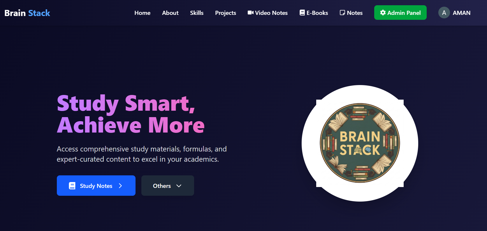

## Brain Stack Education

Smart study resources for college students. Built and maintained by Pratham Khurana and Aman Kashyap.

- **Live**: [brainstackeducation.in](https://brainstackeducation.in/)



### About the project 🧠

**Brain Stack Education** is a student-first platform that centralizes high‑quality academic materials in one place. It provides curated notes, PYQs, formulas, timetables, assignments, events, e‑books, and video lectures with a clean, responsive UI and a simple content pipeline for admins.

- **What you can do**:
  - Browse study materials by semester and subject
  - Watch video lectures and access e‑books
  - Download or preview files hosted on Cloudinary
  - Authenticate via Google and email OTP; admins can manage content

### Built With 🧰

- **Next.js 15** and **React 18** (TypeScript)
- **Tailwind CSS 4** for styling
- **MongoDB + Mongoose** for data persistence
- **Cloudinary** for file and media storage
- **Nodemailer** for email OTP delivery
- **Google OAuth 2.0** via `google-auth-library`
- Utility libs: `formidable`/`multer` for uploads, `next-cloudinary`, `react-icons`

### Getting Started 🚀

#### Prerequisites
- Node.js >= 18
- MongoDB database (Atlas or self‑hosted)
- Cloudinary account
- Gmail (or SMTP) account for transactional email

#### 1) Clone and install
```bash
git clone <your-fork-or-repo-url>
cd brainstack
npm install
```

#### 2) Configure environment
Create a `.env.local` in the project root:
```bash
# Database
MONGODB_URI=mongodb+srv://<user>:<pass>@<cluster>/<db>?retryWrites=true&w=majority

# Cloudinary
CLOUDINARY_CLOUD_NAME=your_cloud_name
CLOUDINARY_API_KEY=your_api_key
CLOUDINARY_API_SECRET=your_api_secret

# Email (Gmail example)
EMAIL_USER=your.email@example.com
EMAIL_PASS=your_app_password

# Google OAuth
GOOGLE_CLIENT_ID=xxxxxxxxxxxx-xxxxxxxxxxxxxxxxxxxxxxxxxxxxxxxx.apps.googleusercontent.com
GOOGLE_CLIENT_SECRET=your_google_client_secret
GOOGLE_REDIRECT_URI=http://localhost:3000/api/auth/google/callback
```

#### 3) Run the app
```bash
npm run dev
# open http://localhost:3000
```

### Usage 📖

- **Browse content**: Go to `/materials` and choose your semester and subject. Switch between tabs: Notes, PYQs, Formulas, Timetable, Assignments, Events, E‑Books, and Video Lectures.
- **Authentication**: Use Google sign‑in. You’ll receive an email OTP for verification. Admins are recognized via the allow‑list in `lib/googleAuth.ts`.
- **Admin content management**: Admins access the panel at `/admin` to upload notes, e‑books, or add YouTube videos. Files are stored on Cloudinary, and metadata is saved to MongoDB.

Core content shape stored in MongoDB:
```ts
type Content = {
  branch: string
  semester: string
  subject: string
  contentType: 'notes' | 'pyq' | 'formulas' | 'timetable' | 'assignments' | 'events' | 'video' | 'ebook'
  fileName?: string
  fileUrl?: string
  publicId?: string
  fileSize?: number
  mimeType?: string
  videoTitle?: string
  videoUrl?: string
  videoId?: string
  uploadedBy: string
  uploadDate: Date
}
```

### Roadmap 🗺️

- [ ] Public user profiles and favorites
- [ ] Search across subjects and content types
- [ ] Role‑based admin (editor, reviewer)
- [ ] Rate‑limit and audit logs for content actions
- [ ] Bulk upload and CSV import for materials
- [ ] Accessibility and internationalization pass

### Project Scripts 🧪

```bash
npm run dev     # start dev server (Turbopack)
npm run build   # production build
npm run start   # start production server
npm run lint    # run linter
```

### Contacts 📬

- **Pratham Khurana**
- **Aman Kashyap**

For general inquiries or collaboration, please open an issue or reach out via the site: [brainstackeducation.in](https://brainstackeducation.in/).

